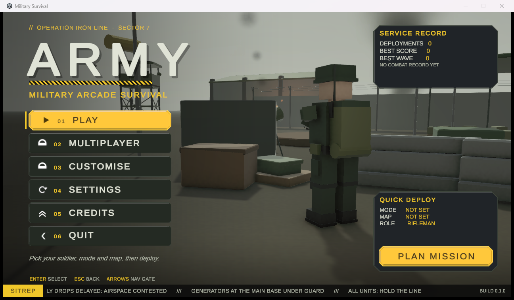
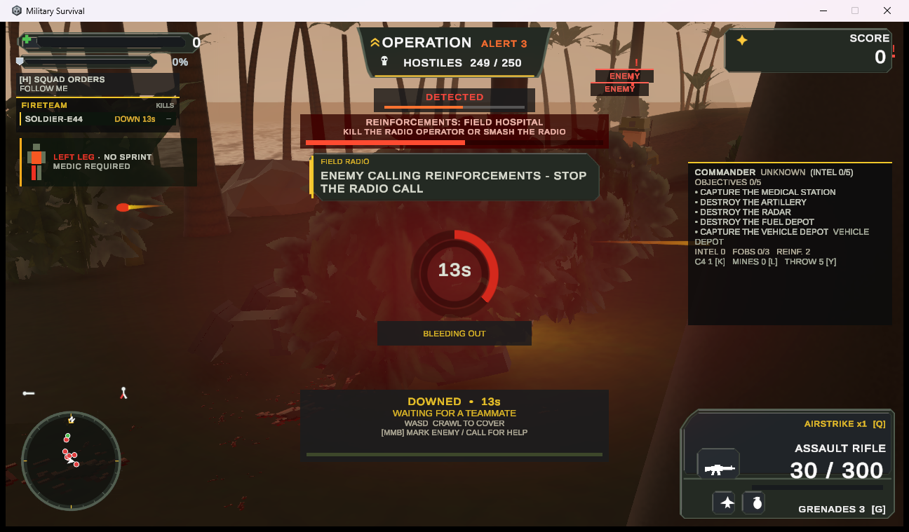
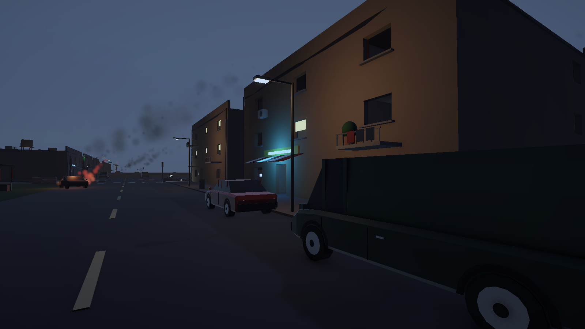

# Military Survival

**Fight · Survive · Improve**

A third-person military arcade shooter for Windows. Hold the line against escalating waves with your AI squad,
take on boss fights and capture the flag, or drop into **Operation: Jungle Hunt** — a free-drop, 1–6 player co-op
PvE operation on an enemy-held jungle island where stealth and all-out assault both work.

---

## Download & play

1. Go to **[Releases](../../releases/latest)** and download the latest **`MilitarySurvival-v0.2.0-Windows.zip`**.
2. **Extract the ZIP** (right-click → *Extract All…*). Keep all the files together — the game won't start from
   inside the ZIP or if you move the `.exe` on its own.
3. Open the extracted `MilitarySurvival` folder and run **`MilitarySurvival.exe`**.

> Windows SmartScreen may warn about an unrecognised app because the game isn't code-signed yet.
> Click **More info → Run anyway**.

No installer, no account. To uninstall, delete the folder.

---

## Game modes

- **Survival** — hold out against escalating enemy waves with your squad.
- **Boss Rush** — back-to-back heavy encounters.
- **Capture the Flag** — on the Battlefield map.
- **Operation: Jungle Hunt** (co-op, 1–6 players) — parachute onto a 1 km jungle island held by 250 soldiers,
  or into **Port Savanne**, an occupied harbour city. Sneak or go loud, take out radios before they call
  reinforcements, gather intel, find and take down the enemy commander, then extract by helicopter.

## Controls

| Action | Key |
|---|---|
| Move / sprint | **W A S D** / **Shift** |
| Aim / fire | **Right mouse** / **Left mouse** |
| Reload | **R** |
| Switch weapon / holster | **1–9**, **mouse wheel** / **0** |
| Jump · vault · climb | **Space** |
| Crouch / prone | **C** / **Z** (**Shift** while crouched: crouch run) |
| Take cover / run to the cover under the crosshair | **Left Ctrl** |
| In cover: aim over / round it · switch side · leave | **Right mouse** · **V** · **Left Ctrl** |
| Grenade | **G** |
| Interact · enter vehicle · revive | **E** |
| Drag a wounded teammate | **T** |
| Role abilities | **F** / **X** |
| Support (airstrike) | **Q** |
| Squad commands | **H** |
| Swap camera shoulder | **V** |
| Show the whole HUD | **Tab** (hold) |
| Pause / back | **Esc** |

**Operation: Jungle Hunt extras**

| Action | Key |
|---|---|
| Map · mark drop point · choose extraction | **M** |
| Jump from the helicopter | **E** |
| Squad: jump with me / drop at the marker | **J** (in the helicopter) |
| Open parachute (free fall) | **Space** |
| Binoculars (hold to mark enemies) | **B** |
| Ping / mark enemy / call for help when downed | **Middle mouse** |
| Throw a distraction | **Y** |
| Silent takedown / capture | **E** (behind or aiming at an unaware enemy) |
| Drag a body | **T** |
| Night vision · C4 · lay mine | **N** · **K** · **L** |

Swimming is automatic in deep water (**Shift** swims faster); you can't use weapons while swimming.

## System requirements

|  | Minimum | Recommended |
|---|---|---|
| OS | Windows 10 64-bit | Windows 10 / 11 64-bit |
| CPU | 4-core, x64 with SSE4.1 | 6-core or better |
| RAM | 8 GB | 16 GB |
| GPU | DirectX 11 / 12, 2 GB VRAM | GTX 1060 / RX 580 class, 4 GB VRAM |
| Disk | 1 GB free | SSD |

Requirements are estimates for this early build. 64-bit Windows only. Co-op uses a direct connection (host UDP port **27960**); the host may need to allow the game
through Windows Firewall.

## Known issues (v0.2.0)

- The game isn't code-signed, so Windows SmartScreen shows a warning on first launch.
- Co-op has been tested with 2 players; 6-player sessions haven't been load-tested yet.
- In Jungle Hunt co-op, only the host can drag enemy bodies, and mines laid by other players only exist on their own machine.
- AI soldiers (squad and enemies) don't swim; they wait at the water's edge.
- Settings are stored per Windows user; deleting the game folder doesn't remove them.

## Changelog

See [CHANGELOG.md](CHANGELOG.md).

## Reporting a problem

Open an issue with what happened, what you expected, and your Windows version. The game's log file helps:
`%USERPROFILE%\AppData\LocalLow\DefaultCompany\Military Survival\Player.log`

---

© 2026 the Military Survival developer. All rights reserved. This repository contains the game's public page and release downloads only;
the game's source code is not published.
